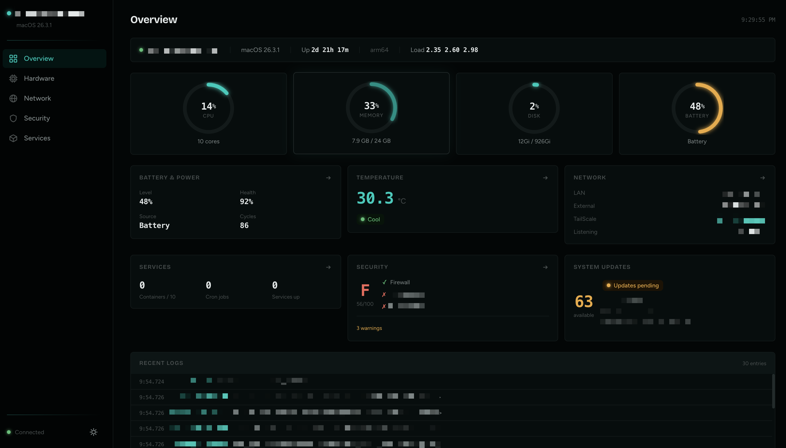
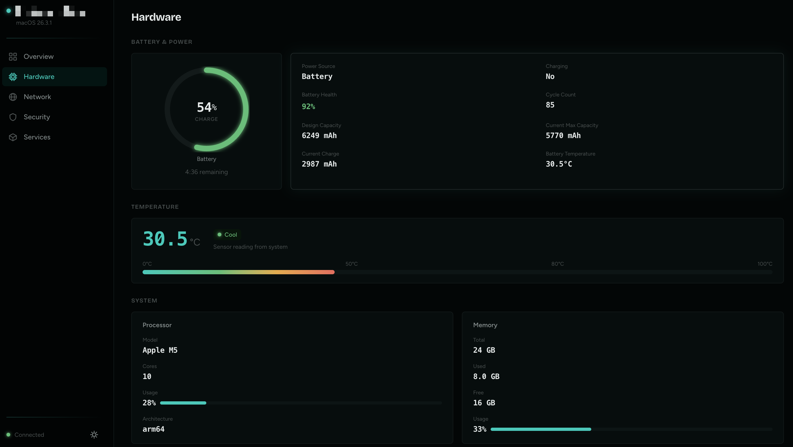
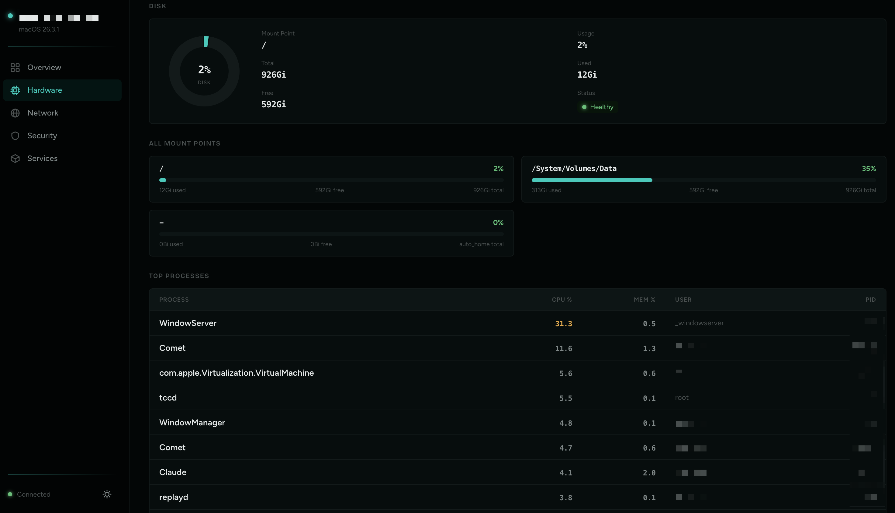
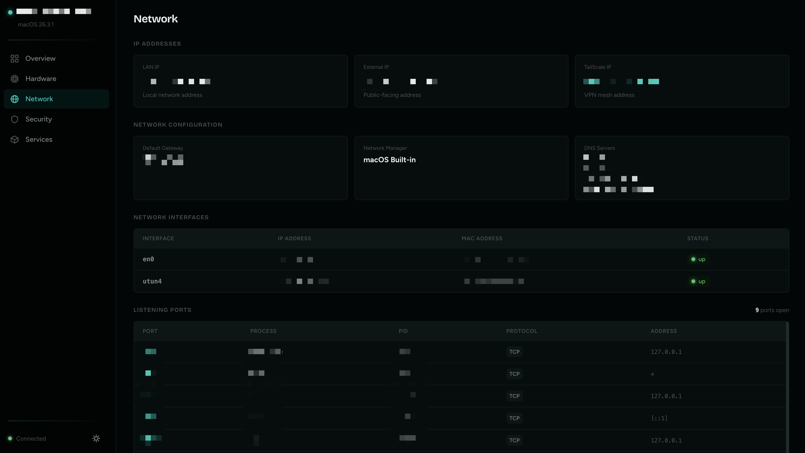
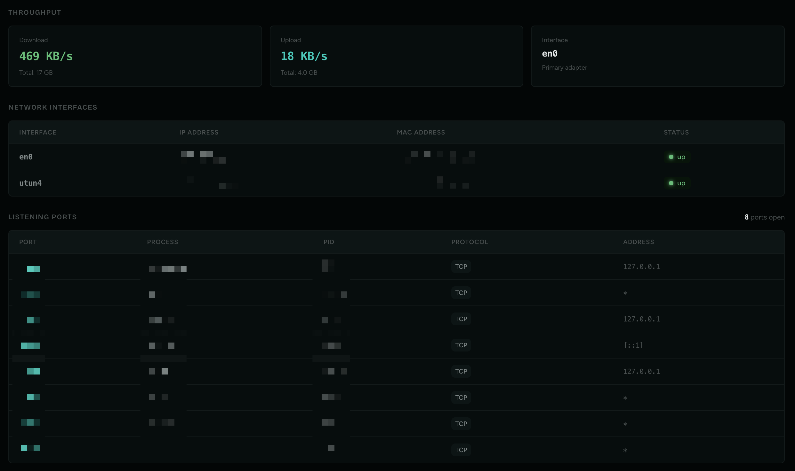
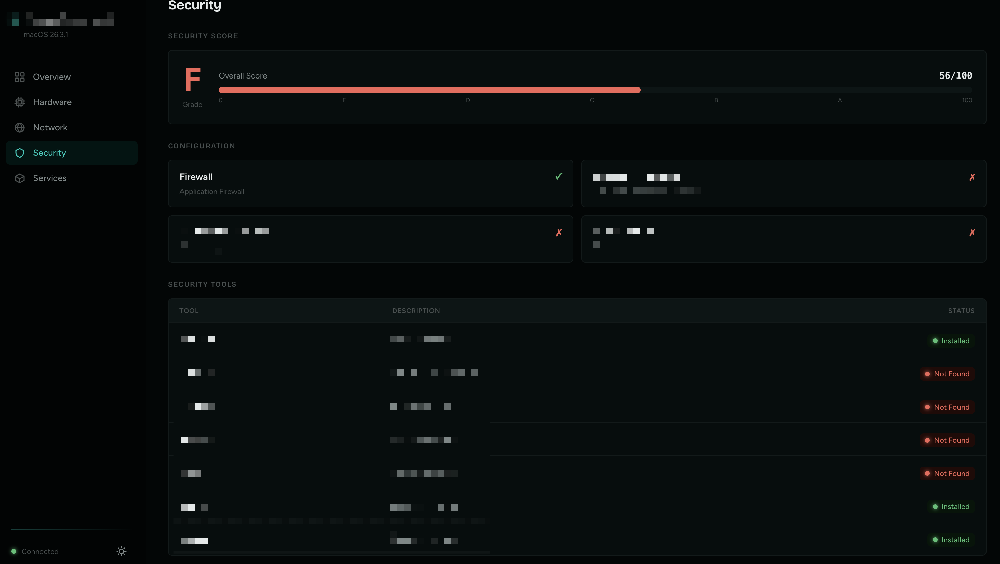
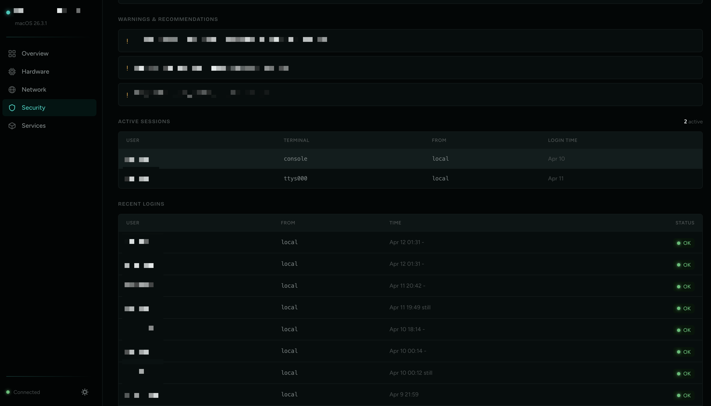
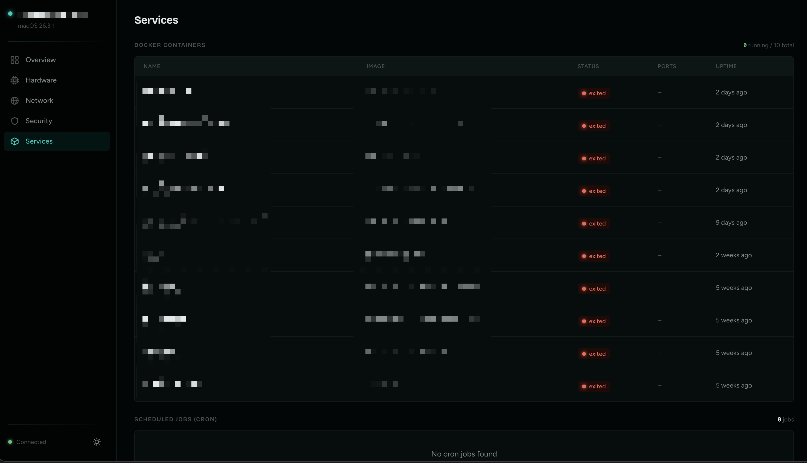

<p align="center">
  
</p>

<p align="center">
  
  
  
  
</p>

# Sentinel

**A self-hosted monitoring dashboard for headless Linux and macOS servers.**

If you run a Linux box or a Mac mini in a closet somewhere, you know the routine — SSH in, run a handful of commands, try to remember what the disk usage was last time. Sentinel replaces that with a single web page you can pull up from your phone.

It's a Next.js app that runs directly on the machine you want to monitor. It reads system state through standard OS commands, presents it in a clean interface, and refreshes every 10 seconds. No agents to install, no cloud accounts, no data leaving your network.

---

<p align="center">
  
</p>

---

## What You Get

### System Vitals

CPU usage (delta-based, not a snapshot), load average (1/5/15 min), memory with accurate active+wired reporting, swap usage, disk utilization across all mount points, battery health with cycle count and capacity degradation, temperature readings, and top processes ranked by CPU.

<p align="center">
  
</p>

<p align="center">
  
</p>

### Network

LAN IP, external IP (cached, refreshed every 5 minutes), TailScale IP (auto-detected if running), default gateway, DNS servers, network manager, real-time download/upload throughput, all network interfaces with MAC addresses and link status, and every listening port with its process name, PID, and protocol.

<p align="center">
  
</p>

<p align="center">
  
</p>

### Security

A security score (0–100, letter graded A through F) based on firewall status, SSH hardening, auto-update configuration, and installed security tools. Shows active SSH sessions, recent logins with success/failure status, and actionable warnings when something needs attention.

<p align="center">
  
</p>

<p align="center">
  
</p>

### Services

Docker containers with state, image, ports, and uptime. Cron jobs with human-readable schedules. Key system daemons (sshd, docker, tailscaled, nginx, etc.) with running/stopped status. Service start history from journalctl appears in the activity timeline.

<p align="center">
  
</p>

### Server Logs (Activity Timeline)

A chronological event feed that aggregates system activity across sources: SSH logins, package installs/removals, service starts, system boots, fail2ban bans, git commits in your vault or knowledge base, and file changes in AI agent directories (OpenClaw, n8n, etc.).

The timeline is powered by `activity-collector.py`, a Python daemon that runs alongside Sentinel and writes events to `activity.jsonl`. Run it once manually or set it up as a systemd service — Sentinel reads the file automatically.

```bash
# Start the collector (run on the monitored machine)
cd /path/to/sentinel
python3 activity-collector.py
```

The collector auto-detects knowledge base apps (Logseq, Foam, Obsidian, Org-mode), AI agent directories (OpenClaw, n8n, Auto-GPT, AnythingLLM, Home Assistant, and more), and git repositories defined in `SENTINEL_GIT_REPOS`. Configure the primary vault path and watched services in the Settings page.

### Also Included

- **System updates** — available package count with details (supports apt, yum, brew, softwareupdate)
- **System logs** — scrollable viewer of recent log entries on the overview page
- **Power actions** — reboot and shutdown with double-click confirmation
- **Dark and light mode** — persistent toggle, follows your preference
- **Mobile-friendly** — bottom tab bar, responsive tables, works well on phones
- **Settings page** — configure vault path, watched services, markdown scanning, and hardware display without editing any files
- **Help overlay** — press `?` anywhere to open an in-app reference covering platform notes, page descriptions, keyboard shortcuts, and setup instructions

---

## Quick Start

**Prerequisites:** Node.js 18+ and npm, on the machine you want to monitor.

```bash
git clone https://github.com/CmdShiftExecute/sentinel.git
cd sentinel
npm install

# Copy the example config and edit it with your paths
cp sentinel.config.example.json sentinel.config.json

npm run build
npm start
```

Open **http://localhost:3333**. That's it.

For development with hot reload:

```bash
npm run dev
```

---

## Deployment

Sentinel is meant to run on the server it monitors. Pick whichever method you're comfortable with.

### pm2

```bash
npm install -g pm2
npm run build

pm2 start npm --name sentinel -- start
pm2 save
pm2 startup   # generates a command to run — follow its output
```

### systemd

Create `/etc/systemd/system/sentinel.service`:

```ini
[Unit]
Description=Sentinel Dashboard
After=network.target

[Service]
WorkingDirectory=/path/to/sentinel
ExecStart=/usr/bin/npm start
Restart=always
User=your-user
Environment=PORT=3333

[Install]
WantedBy=multi-user.target
```

```bash
sudo systemctl enable --now sentinel
```

To also run the activity collector persistently, create a second service unit pointing to `python3 /path/to/sentinel/activity-collector.py`, or add it as a second `ExecStartPost` if your setup allows it.

### Accessing from Other Devices

If your server is headless, [TailScale](https://tailscale.com) is the simplest way to reach the dashboard from your phone or laptop:

```bash
# On the server
curl -fsSL https://tailscale.com/install.sh | sh
sudo tailscale up

# From any device on your tailnet
http://<tailscale-ip>:3333
```

Or expose it on your local network and access via the server's LAN IP.

---

## Power Actions Setup

The reboot and shutdown buttons need passwordless sudo for shutdown commands. On your server:

```bash
sudo visudo
```

Add this line (replace `your-user` with your username):

```
your-user ALL=(ALL) NOPASSWD: /sbin/shutdown, /usr/bin/systemctl reboot, /usr/bin/systemctl poweroff
```

Skip this step if you don't need remote power control — everything else works without it.

---

## Configuration

Sentinel reads from `sentinel.config.json` at the project root. This file is gitignored — your personal paths and service names stay local and are never committed.

Copy the example to get started:

```bash
cp sentinel.config.example.json sentinel.config.json
```

All fields are optional and merge on top of built-in defaults, so you only need to specify what you want to change.

```json
{
  "vault": {
    "primaryPath": "/home/user/vaults/MyVault"
  },
  "markdown": {
    "enabled": true,
    "extraExcludePaths": ["/home/user/skip-this-dir"]
  },
  "services": {
    "watchUnits": [
      { "unit": "docker",  "userUnit": false, "label": "Docker daemon started" },
      { "unit": "my-app",  "userUnit": true,  "label": "My app started" }
    ]
  },
  "hardware": {
    "showBattery": true
  }
}
```

| Field | Description |
|-------|-------------|
| `vault.primaryPath` | Absolute path to your primary knowledge base / Obsidian vault. Git commits from this directory appear in the activity timeline. |
| `markdown.enabled` | Scan for loose markdown files outside the vault. |
| `markdown.extraExcludePaths` | Additional directories to skip when scanning markdown. |
| `services.watchUnits` | systemd units whose start events appear in Server Logs. Set `userUnit: true` for user-space services (equivalent to `--user-unit` in journalctl). |
| `hardware.showBattery` | Show or hide the battery section on the Hardware page. Disable on servers without batteries. |

You can also configure everything through the **Settings page** in the dashboard — no manual JSON editing required.

### Environment Variables

| Variable | Default | Description |
|----------|---------|-------------|
| `PORT` | `3333` | Dashboard port |
| `SENTINEL_VAULT_PATH` | *(from config)* | Override vault path at runtime |
| `SENTINEL_KB_PATH` | *(none)* | Additional knowledge base path for the activity collector |
| `SENTINEL_GIT_REPOS` | *(none)* | Colon-separated list of additional git repos to track |

---

## Platform Support

Sentinel runs on **Linux** and **macOS**. Most features work on both; a few rely on Linux-specific tooling.

| Feature | Linux | macOS |
|---------|:-----:|:-----:|
| CPU / Memory / Disk | ✓ | ✓ |
| Battery & Health | ✓ | ✓ |
| Temperature | ✓ | Partial* |
| Network / Ports | ✓ (`ss`) | ✓ (`lsof`) |
| Throughput | ✓ (`/proc/net/dev`) | ✓ (`netstat`) |
| Firewall status | UFW, iptables | Application Firewall |
| Docker / Cron | ✓ | ✓ |
| System Updates | apt, yum | softwareupdate, brew |
| Power Actions | systemctl, shutdown | shutdown |
| systemd service status | ✓ | — |
| journalctl events (SSH, boots, services) | ✓ | — |
| fail2ban bans | ✓ | — |
| dpkg/apt package log | ✓ | — |

*macOS temperature reads from the battery sensor. For CPU temperature, install [`osx-cpu-temp`](https://github.com/lavoiesl/osx-cpu-temp).

Features that rely on Linux-only tooling (journalctl, fail2ban, dpkg) return empty results on macOS rather than erroring — the dashboard still loads and all other panels work.

---

## Tech Stack

| | |
|---|---|
| **Framework** | Next.js 14 (App Router) |
| **Language** | TypeScript 5 |
| **Styling** | Tailwind CSS 3.4 with OKLCH color system |
| **Charts** | Recharts |
| **Data Fetching** | SWR with 10-second polling |
| **Activity Collection** | Python 3 daemon (`activity-collector.py`) |
| **Fonts** | Bricolage Grotesque + Figtree |

---

## Project Structure

```
sentinel/
├── src/
│   ├── app/
│   │   ├── api/
│   │   │   ├── system/route.ts        # System data collection
│   │   │   ├── activity/route.ts      # Activity timeline reader
│   │   │   ├── settings/route.ts      # Config read/write API
│   │   │   └── actions/route.ts       # Power actions (reboot/shutdown)
│   │   ├── page.tsx                   # Overview dashboard
│   │   ├── hardware/page.tsx          # CPU, memory, disk, battery, processes
│   │   ├── network/page.tsx           # IPs, interfaces, ports, throughput
│   │   ├── security/page.tsx          # Score, tools, sessions, logins
│   │   ├── services/page.tsx          # Docker, cron, system processes
│   │   ├── activity/page.tsx          # Activity timeline
│   │   ├── settings/page.tsx          # Dashboard settings UI
│   │   ├── layout.tsx                 # Root layout with sidebar
│   │   └── globals.css                # Design tokens (OKLCH)
│   ├── components/
│   │   ├── sidebar.tsx                # Desktop sidebar + mobile bottom nav
│   │   ├── help-overlay.tsx           # ? key help modal
│   │   ├── gauge.tsx                  # Animated SVG gauge
│   │   ├── metric-card.tsx            # Stat card with status coloring
│   │   ├── status-badge.tsx           # Status indicator badges
│   │   └── theme-toggle.tsx           # Dark/light mode toggle
│   ├── hooks/
│   │   ├── use-system-data.ts         # SWR data fetching hook
│   │   └── use-theme.ts               # Theme persistence hook
│   └── lib/
│       ├── config.ts                  # Config loader/writer with deep merge
│       ├── types.ts                   # TypeScript interfaces
│       └── utils.ts                   # Formatting utilities
├── activity-collector.py              # Python event collector daemon
├── sentinel.config.example.json      # Committed example config (generic)
├── sentinel.config.json               # Your local config (gitignored)
├── package.json
├── tailwind.config.ts
└── tsconfig.json
```

---

## Contributing

Contributions are welcome. See [CONTRIBUTING.md](CONTRIBUTING.md) for development setup and guidelines.

---

## License

[MIT](LICENSE) — use it however you want.
